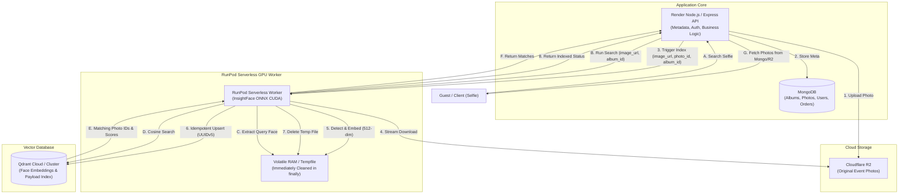

# InsightFace RunPod Serverless Face Recognition Worker

[](https://hub.docker.com/)
[](https://www.runpod.io/serverless-gpu)
[](https://github.com/deepinsight/insightface)
[](https://qdrant.tech/)

A production-ready, GPU-accelerated face recognition and vector search worker built specifically for **RunPod Serverless**, **InsightFace (`buffalo_l`)**, **ONNX Runtime GPU**, **Cloudflare R2**, and **Qdrant Vector Database**.

Engineered for large-scale wedding and event photography platforms handling **50,000 to 100,000+ photos** with sub-second face identification, scale-to-zero GPU cost efficiency, and zero permanent photo retention inside worker containers.

---

## 1. System Architecture



### Core Design Principles:
1. **Zero Permanent Container Storage**: Worker containers never store photos permanently. Images are streamed to temporary files, decoded into memory, processed, and immediately removed in `finally` blocks.
2. **Lean Memory Footprint**: Vector distances are calculated natively inside Qdrant; workers never load large vector matrices or photo archives into Python RAM.
3. **Idempotent Indexing**: Uses deterministic `UUIDv5` hashing based on `photo_id` and `face_index` so re-indexing a photo updates existing vectors rather than creating duplicates.
4. **Selfie-Specific Search Heuristic**: Defaults to selecting the largest bounding box area in query images, preventing accidental background face searches when guests take selfies.

---

## 2. Requirements & Tech Stack

| Component | Technology | Version | Purpose |
|---|---|---|---|
| **Serverless Runtime** | RunPod Serverless SDK | `>=1.7.0` | GPU worker lifecycle & event handling |
| **Face Analysis** | InsightFace | `>=0.7.3` | Face detection & 512-d feature extraction |
| **Inference Accelerator** | ONNX Runtime GPU | `>=1.17.0` | CUDA / TensorRT hardware acceleration |
| **Vector Engine** | Qdrant Client | `>=1.9.0` | Cosine similarity vector search |
| **Image Processing** | OpenCV Headless & Pillow | `>=4.9.0` | BGR array decoding & bbox math |
| **Base Image** | NVIDIA CUDA 12.2.2 Runtime | Ubuntu 22.04 | Official CUDA + cuDNN 8 container |
| **Python** | Python 3.10 | Pinned | Stable numerical runtime |

---

## 3. Repository Structure

```
insightface-runpod/
├── Dockerfile              # Production NVIDIA CUDA container with pre-cached models
├── requirements.txt        # Pinned Python dependencies
├── handler.py              # Official RunPod Serverless entrypoint
├── README.md               # Complete architecture & deployment guide
├── .gitignore              # Ignores .env, models, and caches
├── .dockerignore           # Excludes Git, tests, and local files from image
├── .env.example            # Template for environment variables
│
├── app/
│   ├── __init__.py         # Package root
│   ├── face_engine.py      # InsightFace singleton & CUDA/CPU loader
│   ├── image_loader.py     # Safe streaming image downloader & cleanup context
│   ├── qdrant_service.py   # Qdrant client, collections, upsert & search
│   └── schemas.py          # Pydantic input/output validation models
│
└── tests/
    └── test_handler.py     # 13 comprehensive unit tests
```

---

## 4. RunPod Configuration & Deployment

### Recommended RunPod Settings

Navigate to **RunPod Console > Serverless > Create Endpoint**:

| Setting | Recommended Value | Rationale |
|---|---|---|
| **GPU Type** | **24 GB Class GPU** (RTX 4090, RTX 3090, A5000, L4) | High throughput, cost-effective VRAM for 640x640 batching |
| **Min Workers** | `0` | **Scale-to-Zero**: Incur zero GPU costs when no events are processing |
| **Max Workers** | `1` initially (scale up to 5-10 during massive wedding uploads) | Prevents runaway costs while evaluating load |
| **Idle Timeout** | `5` to `10` seconds | Quickly spins down idle containers after queue clears |
| **Execution Timeout** | `600` seconds (10 minutes) | Accommodates large batch photo indexing tasks |
| **Container Disk** | `20 GB` | Sufficient for CUDA runtime and OS |
| **Volume Disk** | `0 GB` (None required) | Models are pre-baked into the image; no network volume needed |

---

## 5. Docker Setup, Build & Push

### Prerequisites
- Docker installed with NVIDIA Container Toolkit (for local GPU testing).
- Docker Hub or GitHub Container Registry account.

### Step 1: Build the Production Container
Replace `yourusername` with your Docker Hub username:

```bash
cd insightface-runpod

# Build the container (downloads buffalo_l weights during build)
docker build -t yourusername/insightface-runpod:v1.0.0 .
```

### Step 2: Test Locally (Optional)
Run the container locally using GPU acceleration:

```bash
docker run --gpus all --rm \
  -e QDRANT_URL="https://your-cluster.qdrant.io:6333" \
  -e QDRANT_API_KEY="your-api-key" \
  -e QDRANT_COLLECTION="face_embeddings" \
  yourusername/insightface-runpod:v1.0.0
```

### Step 3: Push to Registry
```bash
docker login
docker push yourusername/insightface-runpod:v1.0.0
```

---

## 6. Environment Variables

Configure these in the **RunPod Endpoint Environment Variables** panel:

| Variable | Required | Default | Description |
|---|---|---|---|
| `QDRANT_URL` | **Yes** | - | Cloud or self-hosted Qdrant URL (e.g., `https://xyz.cloud.qdrant.io:6333`) |
| `QDRANT_API_KEY` | **Yes** | - | Qdrant Cloud cluster API key |
| `QDRANT_COLLECTION` | No | `face_embeddings` | Qdrant collection name |
| `MAX_IMAGE_SIZE_MB` | No | `20` | Max allowed image size before rejecting (protects RAM) |
| `REQUEST_TIMEOUT_SECONDS` | No | `60` | HTTP stream timeout for R2 downloads |
| `DEFAULT_SEARCH_LIMIT` | No | `25` | Default max photo matches returned in search |
| `DEFAULT_SCORE_THRESHOLD` | No | `0.45` | Minimum cosine similarity threshold (0.40 - 0.50 recommended) |
| `INSIGHTFACE_MODEL` | No | `buffalo_l` | InsightFace model pack name |
| `DETECTION_SIZE` | No | `640` | Square detection inference size |
| `RUNPOD_DEBUG` | No | `false` | Enable verbose tracebacks for debugging |

---

## 7. API Operations & Payload Examples

### A. Direct Face Detection (`operation: "detect"`)
Extracts raw bounding boxes, scores, and 512-d embeddings without touching Qdrant:

**Request Payload:**
```json
{
  "input": {
    "operation": "detect",
    "image_url": "https://pub-xxxx.r2.dev/events/wedding_001.jpg"
  }
}
```

**Response:**
```json
{
  "success": true,
  "operation": "detect",
  "face_count": 2,
  "faces": [
    {
      "face_index": 0,
      "bbox": [245.2, 112.5, 432.8, 350.1],
      "det_score": 0.9854,
      "embedding_dimension": 512,
      "embedding": [-0.0421, 0.0812, 0.0153, 0.0914, "...512 floats..."]
    }
  ],
  "processing_time_ms": 142.5
}
```

---

### B. Index Event Photo (`operation: "index"`)
Detects all faces in the photo and indexes them into Qdrant with deterministic UUIDs:

**Request Payload:**
```json
{
  "input": {
    "operation": "index",
    "image_url": "https://pub-xxxx.r2.dev/events/wedding_001.jpg",
    "photo_id": "photo_6701a2b",
    "album_id": "album_surat_wedding"
  }
}
```

**Response:**
```json
{
  "success": true,
  "operation": "index",
  "photo_id": "photo_6701a2b",
  "album_id": "album_surat_wedding",
  "faces_indexed": 3,
  "face_count": 3,
  "processing_time_ms": 218.4
}
```

---

### C. Search by Selfie (`operation: "search"`)
Searches Qdrant for all photos matching the guest's selfie:

**Request Payload:**
```json
{
  "input": {
    "operation": "search",
    "image_url": "https://pub-xxxx.r2.dev/guests/selfie_temp.jpg",
    "album_id": "album_surat_wedding",
    "limit": 25,
    "score_threshold": 0.45,
    "face_selection": "largest"
  }
}
```

**Response:**
```json
{
  "success": true,
  "operation": "search",
  "matches": [
    {
      "photo_id": "photo_6701a2b",
      "album_id": "album_surat_wedding",
      "face_index": 0,
      "score": 0.8912,
      "bbox": [245.2, 112.5, 432.8, 350.1]
    },
    {
      "photo_id": "photo_6701a99",
      "album_id": "album_surat_wedding",
      "face_index": 1,
      "score": 0.7645,
      "bbox": [510.0, 180.2, 650.4, 340.0]
    }
  ],
  "query_face": {
    "face_index": 0,
    "bbox": [85.0, 92.0, 310.0, 340.0],
    "det_score": 0.9912
  },
  "total_matches": 2,
  "processing_time_ms": 185.3
}
```

---

### D. Delete Photo Embeddings (`operation: "delete"`)
Removes all vectors associated with a photo if deleted or replaced:

**Request Payload:**
```json
{
  "input": {
    "operation": "delete",
    "photo_id": "photo_6701a2b"
  }
}
```

---

### E. Health Check (`operation: "health"`)
```json
{
  "input": {
    "operation": "health"
  }
}
```

---

## 8. Node.js / Render Backend Integration

Here is how your main Node.js/Express backend on Render calls your RunPod Serverless endpoint using `axios`:

```typescript
import axios from 'axios';

const RUNPOD_API_KEY = process.env.RUNPOD_API_KEY;
const RUNPOD_ENDPOINT_ID = process.env.RUNPOD_ENDPOINT_ID; // e.g. 'vllm-xxxxxx'

const runpodClient = axios.create({
  baseURL: `https://api.runpod.ai/v2/${RUNPOD_ENDPOINT_ID}`,
  headers: {
    'Authorization': `Bearer ${RUNPOD_API_KEY}`,
    'Content-Type': 'application/json'
  },
  timeout: 120000 // 2 minutes
});

/**
 * Indexes a photo uploaded to Cloudflare R2 into Qdrant via RunPod
 */
export async function indexPhotoFaces(photoId: string, albumId: string, r2Url: string) {
  try {
    // runsync executes synchronously and waits for worker completion
    const response = await runpodClient.post('/runsync', {
      input: {
        operation: 'index',
        image_url: r2Url,
        photo_id: photoId,
        album_id: albumId
      }
    });

    const result = response.data.output;
    if (!result?.success) {
      throw new Error(result?.error || 'RunPod indexing failed');
    }

    console.log(`Indexed ${result.faces_indexed} faces for photo ${photoId}`);
    return result;
  } catch (error: any) {
    console.error('RunPod Index Error:', error.response?.data || error.message);
    throw error;
  }
}

/**
 * Searches for event photos matching a guest's selfie
 */
export async function searchGuestPhotos(albumId: string, selfieUrl: string) {
  try {
    const response = await runpodClient.post('/runsync', {
      input: {
        operation: 'search',
        image_url: selfieUrl,
        album_id: albumId,
        limit: 50,
        score_threshold: 0.45,
        face_selection: 'largest'
      }
    });

    const result = response.data.output;
    if (!result?.success) {
      throw new Error(result?.error || 'RunPod search failed');
    }

    // result.matches contains: [{ photo_id, album_id, score, bbox }, ...]
    return result.matches;
  } catch (error: any) {
    console.error('RunPod Search Error:', error.response?.data || error.message);
    throw error;
  }
}
```

---

## 9. Local Testing

Run the test suite using Python:

```bash
# Using pytest
pytest tests/test_handler.py -v

# Or using standard python
python tests/test_handler.py
```

All 13 unit tests validate:
- Schema boundary values and fallback strategies
- Memory cleanup in `finally` blocks
- Query parameter sanitization from logged URLs
- L2 unit vector normalization
- Face selection area heuristics
- Idempotent UUIDv5 point ID generation

---

## 10. Security Best Practices

1. **No Secrets in Source or Images**: API keys (`RUNPOD_API_KEY`, `QDRANT_API_KEY`) must never be placed in Dockerfiles, Git repositories, or client code. Pass them exclusively via RunPod Environment Variables.
2. **Signed R2 URL Expiration**: When generating signed URLs for R2 photos, set a short expiration (e.g. 5–15 minutes).
3. **URL Log Sanitization**: Worker logs automatically strip URL query parameters and signatures before writing to standard out to avoid token leakage.
4. **Input Size Validation**: `MAX_IMAGE_SIZE_MB` terminates oversize image streams before exhausting serverless RAM.

---

## 11. Troubleshooting

| Issue | Cause | Resolution |
|---|---|---|
| `CUDAExecutionProvider not available` | NVIDIA driver or CUDA runtime mismatch | Ensure RunPod pod template has GPU enabled and image is based on `nvidia/cuda:12.x`. |
| `Qdrant connection timeout` | Network firewall or incorrect cluster URL | Verify `QDRANT_URL` includes the port (usually `:6333` for cloud endpoints) and that the API key is valid. |
| `Cold start takes 40+ seconds` | Model weights downloading at boot time | The provided `Dockerfile` runs `app.prepare()` during the `docker build` stage, embedding model weights directly into the container filesystem. |
| `No faces detected in selfie` | Poor lighting or subject too far | Prompt the user in your frontend to take a clear, well-lit portrait selfie. |

---

## 12. Important Model Licensing Notice

> [!WARNING]
> **Pretrained Model Licensing Restrictions**
>
> The **InsightFace** software code itself is distributed under the **MIT License**. However, the default pretrained model weights (including the `buffalo_l` and `antelopev2` model packs) are distributed under **separate non-commercial research licensing terms** by their respective dataset creators and trainers.
>
> **Do not assume that the pretrained model weights are commercially licensed.**
>
> If you are deploying this platform for a commercial business:
> 1. Review the [InsightFace Model Zoo License](https://github.com/deepinsight/insightface/tree/master/model_zoo).
> 2. For commercial use, train custom face embedding models or obtain a commercial license as specified by the InsightFace authors.
